# VectorSearch

A vector search engine built from scratch to understand the **algorithms, mathematics, data structures, memory behavior, optimization techniques, and systems trade-offs** behind modern vector databases and approximate nearest-neighbor (ANN) search engines.

The goal is not to build another wrapper around FAISS, HNSWlib, or a vector database.

The goal is to understand and implement the machinery ourselves.

---

# Vision

Modern AI systems depend heavily on vector search:

```text
Embedding Model
      │
      ▼
   Vector
      │
      ▼
┌─────────────────┐
│  Vector Search  │
└─────────────────┘
      │
      ▼
Top-k nearest vectors
      │
      ▼
RAG / Recommendation / Retrieval
```

This project progressively builds that system from the simplest possible implementation toward a production-oriented approximate nearest-neighbor engine.

The progression is intentional:

```text
Exact Search
     │
     ▼
Vectorized Exact Search
     │
     ▼
Top-k Optimization
     │
     ▼
Distance Computation Optimization
     │
     ▼
Dimensionality Experiments
     │
     ▼
Batch Search
     │
     ▼
Memory Layout / Data Representation
     │
     ▼
Cache / Memory Profiling
     │
     ▼
HNSW
     │
     ▼
Recall / Latency Trade-offs
     │
     ▼
Persistence
     │
     ▼
Production-oriented Vector Index
```

The project should make questions like these intuitive:

* Why is brute-force vector search slow?
* Why does NumPy outperform a Python loop?
* What actually determines vector-search latency?
* Why does memory layout matter?
* Why can avoiding temporary allocations produce large speedups?
* Why is dot-product computation useful for L2 distance?
* Why does `argpartition` outperform a complete sort for small `k`?
* Why does increasing dimensionality hurt performance?
* Does batching improve throughput?
* What happens when the working set becomes large?
* Why do vector databases use ANN instead of exact search?
* How does HNSW achieve high recall with sublinear search?
* What does `efSearch` actually trade off?
* How do recall, latency, throughput, and memory interact?
* How do production vector indexes handle persistence and updates?

---

# Current Status

## Completed

* [x] Project structure and packaging
* [x] Vector distance metrics
* [x] Row normalization
* [x] Exact brute-force Python-loop search
* [x] Exact vectorized NumPy search
* [x] Input validation
* [x] Deterministic tie-breaking
* [x] Unit tests for metrics
* [x] Unit tests for exact search
* [x] Unit tests comparing loop and NumPy implementations
* [x] Editable package installation
* [x] Pytest `src/` import configuration
* [x] Reproducible synthetic datasets
* [x] Exact-search benchmark
* [x] Latency measurements
* [x] Benchmark result serialization
* [x] Exact-search latency visualization
* [x] Python loop vs NumPy benchmark
* [x] Cache / working-set benchmark
* [x] Cache / memory benchmark result serialization
* [x] Memory footprint vs latency visualization
* [x] Memory footprint vs throughput visualization
* [x] Top-k `argsort` vs `argpartition` benchmark
* [x] Top-k benchmark result serialization
* [x] Top-k latency visualization
* [x] Top-k QPS visualization
* [x] Top-k speedup visualization
* [x] Dimensionality benchmark
* [x] Dimensionality benchmark result serialization
* [x] Dimensionality vs latency visualization
* [x] Dimensionality vs memory visualization
* [x] Dimensionality vs QPS visualization
* [x] Distance-computation profiling
* [x] Dot-product identity optimization
* [x] Numerical equivalence testing for distance methods
* [x] Batch-search benchmark
* [x] Memory-layout / strided-array benchmark
* [x] Benchmark result JSON serialization

## Current Test Status

```text
27 tests passed
```

Run the complete test suite:

```bash
PYTHONPATH=src python -m pytest -v
```

---

# Project Structure

```text
vector-search/
│
├── pyproject.toml
├── README.md
│
├── src/
│   └── vector_search/
│       ├── __init__.py
│       ├── metrics.py
│       ├── datasets.py
│       ├── exact_loop.py
│       ├── exact_numpy.py
│       ├── batch.py
│       └── hnsw.py                    # planned
│
├── tests/
│   ├── test_metrics.py
│   ├── test_exact.py
│   ├── test_exact_numpy.py
│   └── test_hnsw.py                   # planned
│
├── benchmarks/
│   ├── run_exact.py
│   ├── compare_exact.py
│   ├── run_cache.py
│   ├── plot_cache.py
│   ├── run_topk.py
│   ├── plot_topk.py
│   ├── run_dimension.py
│   ├── plot_dimension.py
│   │
│   ├── profile_distance.py
│   ├── compare_distance_methods.py
│   ├── batch_search.py
│   ├── compare_batch_topk.py
│   ├── profile_batch.py
│   ├── profile_batch_selection.py
│   ├── repeat_dtype.py
│   ├── run_dtype.py
│   ├── run_layout.py
│   ├── run_strided.py
│   ├── plot_results.py
│   │
│   ├── run_hnsw.py                    # planned
│   ├── compare_faiss.py               # planned
│   │
│   └── results/
│       ├── exact.json
│       ├── exact_comparison.json
│       ├── cache.json
│       ├── topk.json
│       ├── dimension.json
│       ├── batch.json
│       ├── dtype.json
│       ├── layout.json
│       └── strided.json
│
└── plots/
    ├── exact_scaling.png
    ├── exact_qps.png
    ├── exact_loop_vs_numpy.png
    ├── cache_latency.png
    ├── cache_qps.png
    ├── topk_latency.png
    ├── topk_qps.png
    ├── topk_speedup.png
    ├── dimension_latency.png
    ├── dimension_memory.png
    ├── dimension_qps.png
    ├── batch_scaling.png
    ├── dtype_latency.png
    ├── dtype_qps.png
    ├── layout_latency.png
    └── strided_latency.png
```

---

# 1. Vector Metrics

The first layer is the mathematics of similarity search.

## Squared L2 Distance

For two vectors:

```text
q = query
x = database vector
```

we calculate:

```text
d(q, x) = Σ(qᵢ - xᵢ)²
```

We use **squared L2 distance** because the square root is unnecessary when only ranking vectors by distance.

If:

```text
d₁ < d₂
```

then:

```text
√d₁ < √d₂
```

so the ranking is identical.

Implemented in:

```text
src/vector_search/metrics.py
```

## Normalization

We also implemented row-wise vector normalization.

For:

```text
x = [x₁, x₂, ..., xD]
```

the L2 norm is:

```text
||x||₂ = √(Σxᵢ²)
```

and the normalized vector is:

```text
x̂ = x / ||x||₂
```

This becomes important later when comparing cosine similarity with L2 distance.

---

# 2. Exact Brute-Force Search

The first search implementation is deliberately simple.

```text
Query
  │
  ▼
Compare against vector 1
Compare against vector 2
Compare against vector 3
       ...
Compare against vector N
  │
  ▼
Rank candidates
  │
  ▼
Return top-k
```

Implemented in:

```text
src/vector_search/exact_loop.py
```

The main class is:

```python
ExactLoopIndex
```

This implementation serves as the **correctness reference implementation**.

The important property is that every query examines every vector:

```text
O(ND)
```

for distance computation.

---

# 3. Exact Search Guarantees

The exact index intentionally provides strong correctness guarantees.

## Dimension Validation

Vectors must have exactly the configured dimension.

```text
dimension = 3

[1, 2, 3]       ✓
[1, 2]          ✗
[1, 2, 3, 4]    ✗
```

## Finite-Value Validation

NaN and infinity are rejected.

```text
[1, 2, 3]        ✓
[1, NaN, 3]      ✗
[1, Inf, 3]      ✗
```

This prevents undefined distance calculations.

## Duplicate IDs

Each item ID must be unique.

## Valid k

Search requires:

```text
1 <= k <= number_of_vectors
```

## Deterministic Results

Results are ordered by:

```text
(distance, item_id)
```

For example:

```text
distance    ID

1.0         20
1.0         10
```

becomes:

```text
10
20
```

This is important for reproducible tests and benchmarks.

---

# 4. Vectorized Exact Search

The next implementation performs the same mathematical operation using vectorized NumPy operations.

Implemented in:

```text
src/vector_search/exact_numpy.py
```

The original distance computation is conceptually:

```python
distances = np.sum((vectors - query) ** 2, axis=1)
```

Instead of executing a Python loop over every vector, NumPy performs the computation using optimized native numerical operations.

The important point is:

> **The algorithm has not changed.**

Both implementations perform exact search.

```text
ExactLoopIndex
      │
      │ same mathematical algorithm
      ▼
ExactNumPyIndex
```

The NumPy implementation therefore gives us a performance baseline before introducing approximate search.

---

# 5. Correctness Testing

Every major component is developed test-first.

## Metrics

* Known squared-L2 result
* Normalized vectors have unit norm

## Exact Search

* Correct nearest neighbors
* Sorted results
* Deterministic tie-breaking
* Wrong vector dimension
* Duplicate IDs
* Empty index
* Invalid `k`
* `k=1`
* `k=N`
* Wrong query dimension
* NaN vectors
* Infinite vectors
* NaN queries
* Infinite queries

## NumPy Exact Search

Additional tests verify:

* Vector storage
* ID handling
* Wrong ID count
* Duplicate IDs
* NumPy and loop implementations produce identical results
* Multiple randomized trials produce identical nearest-neighbor results
* Deterministic tie-breaking at the `k` boundary

## Current Test Status

```text
27 passed
```

---

# 6. Exact Search Benchmark

The exact NumPy implementation is benchmarked across dataset sizes.

Current benchmark environment:

```text
Python:     3.13.5
Platform:   macOS 15.2 arm64
CPU cores:  8
RAM:        8 GB
dtype:      float32
```

For:

```text
D = 128
k = 10
queries = 200
```

the current benchmark produced:

|    N |      p50 |       p95 |       p99 |    QPS |
| ---: | -------: | --------: | --------: | -----: |
|   1K | 0.055 ms |  0.061 ms |  0.068 ms | 17,676 |
|  10K | 0.658 ms |  0.678 ms |  0.708 ms |  1,514 |
| 100K | 9.098 ms | 11.512 ms | 23.033 ms |  102.8 |

The dominant trend is:

```text
N increases
    │
    ▼
More vectors scanned
    │
    ▼
More distance computations
    │
    ▼
Higher latency
    │
    ▼
Lower QPS
```

### Exact Search Scaling

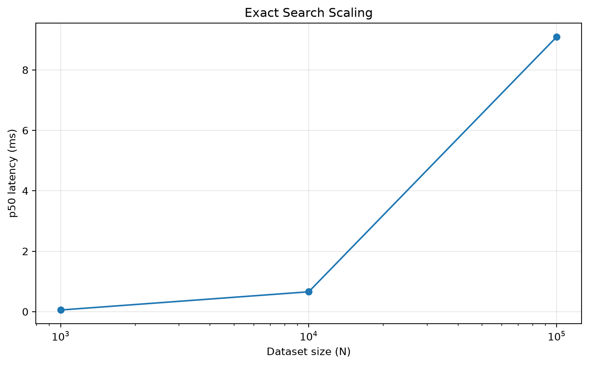

### Exact Search Throughput

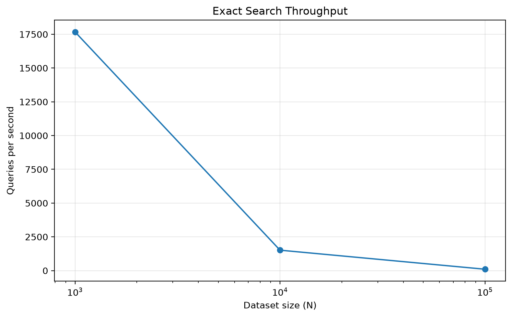

Results are stored in:

```text
benchmarks/results/exact.json
```

Run:

```bash
PYTHONPATH=src python benchmarks/run_exact.py
```

---

# 7. Python Loop vs NumPy

The first major optimization compares the Python implementation against vectorized NumPy.

Both implementations perform:

```text
Exact nearest-neighbor search
```

The difference is primarily execution strategy.

```text
Python Loop

    │
    ├── Python-level iteration
    ├── Python-level arithmetic
    └── repeated interpreter overhead

            VS

NumPy

    │
    ├── vectorized operations
    ├── native compiled code
    └── optimized numerical kernels
```

The benchmark demonstrated that vectorization provides a substantial performance improvement while preserving exact results.

### Plot

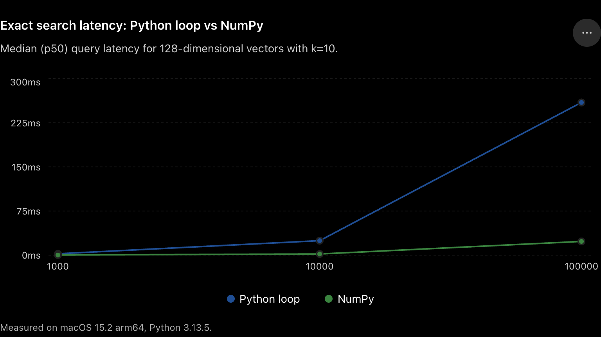

Run:

```bash
PYTHONPATH=src python benchmarks/compare_exact.py
```

---

# 8. Distance Computation Optimization

After vectorization, the next question became:

> **Where exactly is the time going?**

We profiled the distance computation into:

```text
subtraction
einsum
total distance computation
```

For:

```text
N = 100,000
D = 128
queries = 256
k = 10
```

the current profiling results show approximately:

```text
subtraction     ≈ 5.9 ms p50
einsum          ≈ 1.28 ms p50
total distance  ≈ 7.2 ms p50
```

This revealed that the temporary subtraction operation was a significant portion of the distance-computation cost.

Run:

```bash
PYTHONPATH=src python benchmarks/profile_distance.py
```

---

# 9. Dot-Product Identity

For squared L2 distance:

```text
||x - q||²
```

we can use the identity:

```text
||x - q||²
=
||x||² + ||q||² - 2x·q
```

Therefore:

```text
distance
=
vector_norm²
+
query_norm²
-
2 * dot_product
```

Instead of explicitly constructing:

```text
x - q
```

for every vector, we can compute the distance using dot products.

The key systems advantage is:

```text
Subtract + einsum

vectors
   │
   ▼
temporary (N, D) delta
   │
   ▼
distance

             VS

Dot-product identity

vectors
   │
   ▼
dot products
   │
   ▼
distance
```

The `(N, D)` temporary matrix is avoided.

## Numerical Equivalence

Before accepting the optimization, both methods are checked for numerical equivalence.

```text
✓ Both methods produce equivalent distances
```

## Benchmark

Current results:

```text
subtract + einsum
p50 ≈ 7.17 ms

dot-product identity
p50 ≈ 0.93 ms
```

Measured speedup:

```text
≈ 7.67×
```

This is one of the most significant optimizations discovered so far.

Run:

```bash
PYTHONPATH=src python benchmarks/compare_distance_methods.py
```

The important lesson is:

> **A mathematically equivalent formulation can have dramatically different systems-level performance because it changes memory allocation and data movement.**

---

# 10. Top-k Selection

Exact search does more than compute distances.

After calculating:

```text
N distances
```

we need to select:

```text
k nearest vectors
```

If:

```text
N = 1,000,000
k = 10
```

fully sorting one million distances is unnecessary.

We therefore compare:

```text
Full sorting

np.argsort

        VS

Partial selection

np.argpartition
       │
       ▼
sort only selected candidates
```

This introduces an important systems principle:

> **Do not perform work that the query does not require.**

---

# 11. Top-k Benchmark

The benchmark compares:

```text
np.argsort
```

against:

```text
np.argpartition + final sort
```

for:

```text
k = 10
```

The measured speedup was approximately:

```text
N = 1K
    ↓
1.64×

N = 10K
    ↓
1.67×

N = 100K
    ↓
2.02×

N = 1M
    ↓
2.06×
```

The improvement becomes more significant as `N` increases.

### Top-k Latency

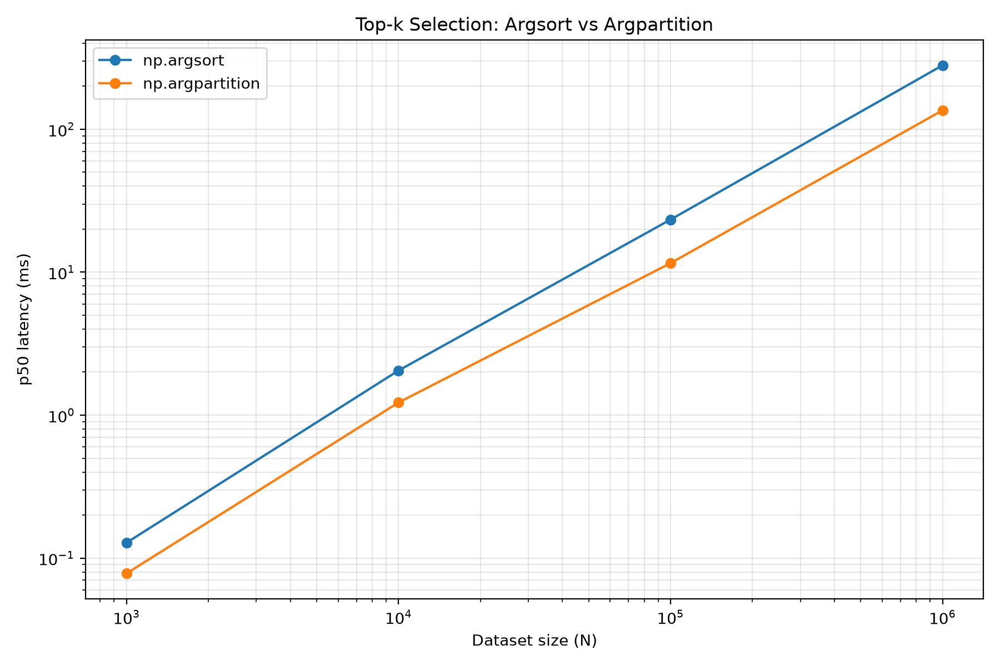

### Top-k QPS

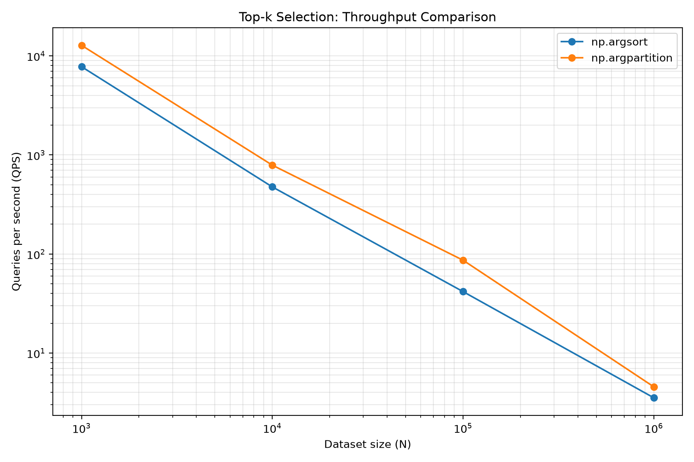

### Top-k Speedup

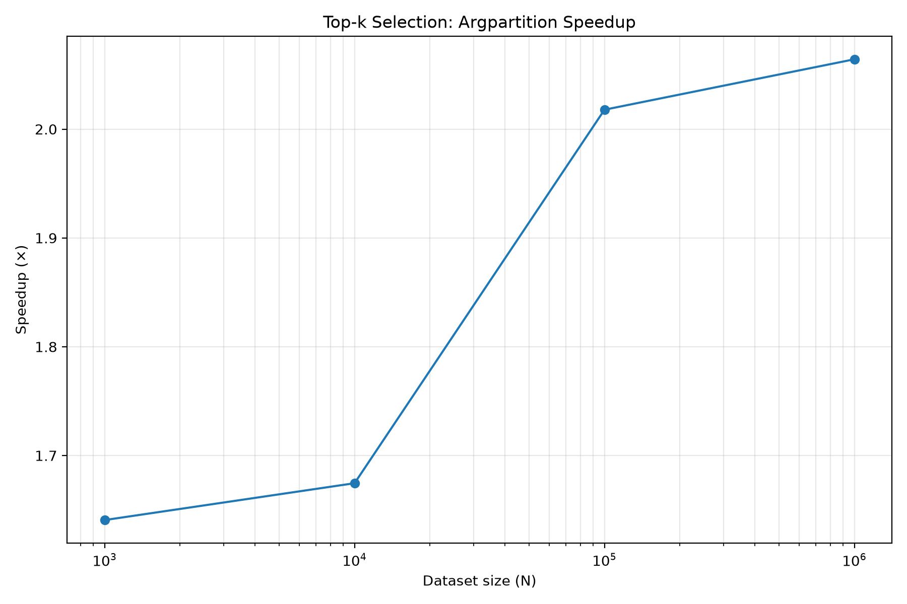

Run:

```bash
PYTHONPATH=src python benchmarks/run_topk.py
```

Results:

```text
benchmarks/results/topk.json
```

---

# 12. Cache and Memory Behavior

Once the algorithm is vectorized, memory behavior becomes an increasingly important part of performance.

The objective is to understand how increasing the dataset changes:

* Working-set size
* Memory footprint
* Query latency
* Throughput

We benchmarked dataset sizes from:

```text
256 → 1M vectors
```

with:

```text
D = 128
k = 10
queries = 200
dtype = float32
```

The working set grows from approximately:

```text
0.125 MB
```

at 256 vectors to:

```text
488.28 MB
```

at 1M vectors.

Observed p50 latency grows from approximately:

```text
0.036 ms
```

to:

```text
285.774 ms
```

while QPS falls from approximately:

```text
25,879 QPS
```

to:

```text
2.74 QPS
```

The experiment demonstrates the relationship between:

```text
Dataset size
     │
     ▼
Working-set size
     │
     ▼
Amount of data processed
     │
     ▼
Query latency
     │
     ▼
Throughput
```

Importantly, this experiment does **not** by itself prove a particular CPU-cache boundary. It establishes the performance behavior that can later be investigated using hardware-performance counters and more detailed profiling.

### Memory vs Latency

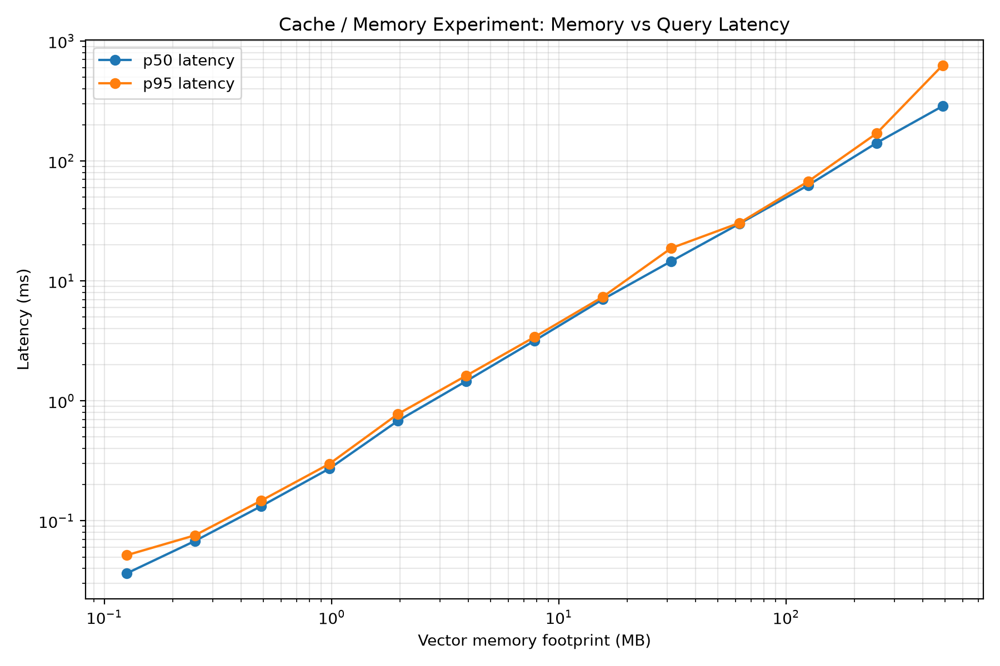

### Memory vs QPS

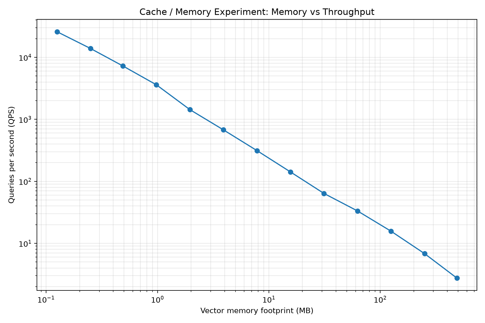

Results:

```text
benchmarks/results/cache.json
```

---

# 13. Dimensionality Experiments

The next experiment investigates vector dimensionality.

The distance calculation is:

```text
d(q, x) = Σ(qᵢ - xᵢ)²
```

Increasing `D` therefore increases:

* Numerical operations
* Memory traffic
* Vector storage

We benchmarked:

```text
D = 64
D = 128
D = 384
D = 768
D = 1536
```

using:

```text
N = 100,000
k = 10
queries = 200
dtype = float32
```

Current results:

| Dimension |    Memory |        p50 |        p95 |   QPS |
| --------: | --------: | ---------: | ---------: | ----: |
|        64 |  24.41 MB |  18.269 ms |  18.741 ms | 54.54 |
|       128 |  48.83 MB |  23.349 ms |  26.343 ms | 40.84 |
|       384 | 146.48 MB |  49.436 ms |  51.623 ms | 19.99 |
|       768 | 292.97 MB |  91.329 ms |  99.598 ms | 10.84 |
|      1536 | 585.94 MB | 182.590 ms | 279.599 ms |  4.98 |

The trend is:

```text
Higher dimensionality
        │
        ▼
More values per vector
        │
        ▼
More computation
        │
        ▼
More memory traffic
        │
        ▼
Higher latency
        │
        ▼
Lower QPS
```

### Dimensionality vs Latency

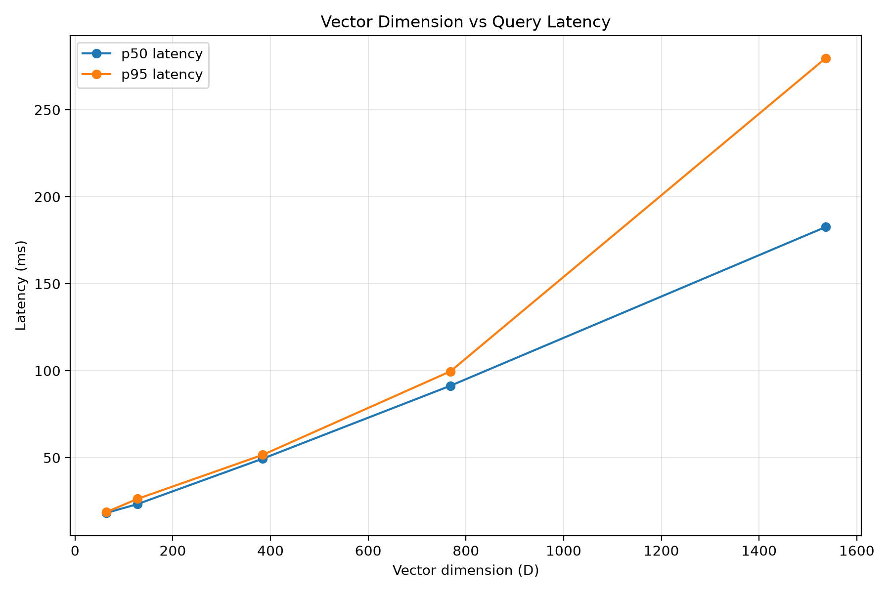

### Dimensionality vs Memory

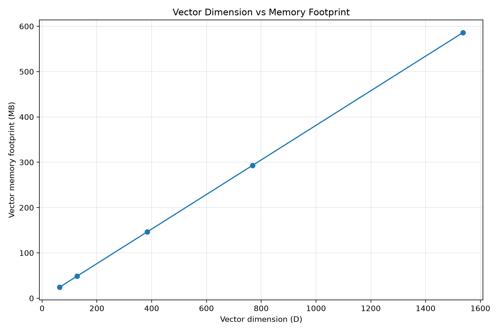

### Dimensionality vs QPS

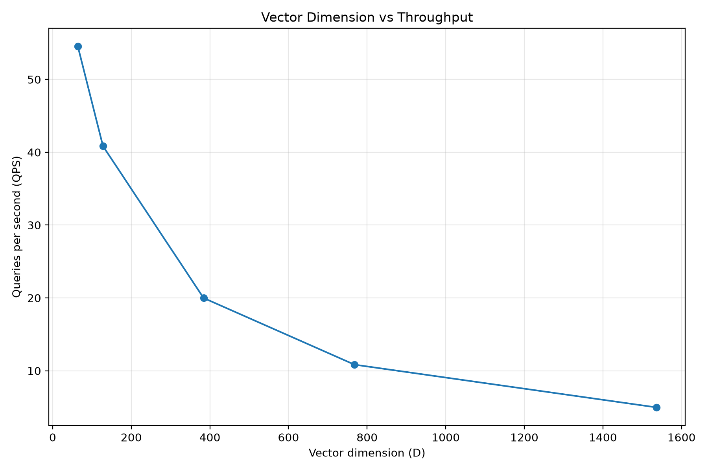

Results:

```text
benchmarks/results/dimension.json
```

---

# 14. Batch Search

The next systems experiment investigates processing multiple queries together.

Instead of:

```text
query
  │
  ▼
search
  │
  ▼
result
```

we can process:

```text
query 1 ─┐
query 2 ─┤
query 3 ─┤
   ...   ┤
query N ─┘
         │
         ▼
    batch search
```

The objective is to understand whether batching improves hardware utilization and throughput.

We benchmarked:

```text
batch = 1
batch = 8
batch = 16
batch = 32
batch = 64
batch = 128
```

using:

```text
N = 100,000
D = 128
queries = 256
k = 10
```

## Current Results

The benchmark produced:

| Batch size | Per-query latency |   QPS |
| ---------: | ----------------: | ----: |
|          1 |         13.925 ms | 71.81 |
|          8 |         13.640 ms | 73.31 |
|         16 |         13.258 ms | 75.43 |
|         32 |         14.362 ms | 69.63 |
|         64 |         18.081 ms | 55.31 |
|        128 |        560.608 ms |  1.78 |

The result is interesting because batching does **not** automatically improve performance.

Instead:

```text
Small batch
    │
    ▼
Similar per-query latency

Moderate batch
    │
    ▼
Small improvement

Larger batch
    │
    ▼
Higher memory pressure
    │
    ▼
Performance degradation
```

In this implementation and hardware configuration, the best observed point was around:

```text
batch = 16
```

with approximately:

```text
75.43 QPS
```

This demonstrates an important systems lesson:

> **Batching is an optimization only when the underlying computation benefits from increased hardware utilization without causing excessive memory pressure.**

Results:

```text
benchmarks/results/batch.json
```

Run:

```bash
PYTHONPATH=src python benchmarks/batch_search.py
```

---

# 15. Memory Layout and Strided Access

We also began investigating how the physical memory layout of vectors affects performance.

A contiguous matrix has:

```text
shape:   (N, D)
strides: (D * sizeof(dtype), sizeof(dtype))
```

For:

```text
float32
D = 128
```

the row stride is:

```text
128 × 4 = 512 bytes
```

We compare:

```text
contiguous
stride ×2
stride ×4
stride ×8
```

while keeping the logical vector shape unchanged.

The benchmark showed:

```text
contiguous
p50 ≈ 15.28 ms

stride ×2
p50 ≈ 14.89 ms

stride ×4
p50 ≈ 15.56 ms

stride ×8
p50 ≈ 15.03 ms
```

The results are surprisingly close.

This is useful because it prevents us from making an unsupported assumption that larger strides must automatically produce dramatically worse performance.

The experiment also demonstrates why controlled benchmarking matters.

### Current Relative Results

```text
contiguous   p50=1.00x   QPS=1.00x
stride_x2    p50=0.97x   QPS=1.11x
stride_x4    p50=1.02x   QPS=1.00x
stride_x8    p50=0.98x   QPS=1.10x
```

At this scale, the benchmark does **not** show a clear performance penalty from these stride patterns.

Further investigation is required with larger working sets, more controlled memory-access patterns, and hardware-performance measurements.

Results:

```text
benchmarks/results/strided.json
```

Run:

```bash
PYTHONPATH=src python benchmarks/run_strided.py
```

---

# 16. Data Type Experiments

We are also investigating the effect of vector representation.

For example:

```text
float32
    ↓
4 bytes / dimension

float64
    ↓
8 bytes / dimension
```

For:

```text
N vectors
D dimensions
```

the vector storage requirement is:

```text
memory = N × D × sizeof(dtype)
```

A wider datatype increases storage and potentially memory traffic.

The benchmark infrastructure now includes:

```text
benchmarks/run_dtype.py
benchmarks/repeat_dtype.py
benchmarks/results/dtype.json
```

The objective is to measure the actual effect of datatype choice instead of assuming that smaller or larger representations are always faster.

---

# 17. One-Command Benchmark Plotting

The benchmark results are designed to be converted into plots from a single command.

Run:

```bash
PYTHONPATH=src python benchmarks/plot_results.py
```

The plotting pipeline is intended to generate the important visualizations from:

```text
benchmarks/results/*.json
```

including:

```text
Exact scaling
Exact QPS
Batch scaling
Top-k performance
Dimensionality scaling
Memory behavior
Datatype effects
Memory-layout effects
```

This keeps benchmark generation and visualization reproducible.

---

# 18. HNSW

After understanding the exact-search bottlenecks, the next major algorithmic step is HNSW.

HNSW stands for:

**Hierarchical Navigable Small World**

Instead of comparing the query against every vector:

```text
Query
  │
  ├── vector 1
  ├── vector 2
  ├── vector 3
  ├── ...
  └── vector N
```

we construct a navigable graph:

```text
        Layer 2

          A
         / \
        B   C


        Layer 1

     A──B──C──D──E
      \    \  /


       F────G


        Layer 0

 A──B──C──D──E──F──G──H──I...
```

Search navigates through the graph instead of exhaustively evaluating every vector.

This introduces the fundamental ANN trade-off:

```text
                 Recall
                   ▲
                   │
                   │       ●
                   │    ●
                   │  ●
                   │ ●
                   └──────────────► Latency
```

We will study how:

```text
M
efConstruction
efSearch
```

affect:

* Recall
* Latency
* Memory
* Build time

---

# 19. Recall Evaluation

Exact search becomes our ground truth.

For every query:

```text
Exact Search
     │
     ▼
Ground-truth top-k
```

and:

```text
HNSW
 │
 ▼
Approximate top-k
```

we compare the results.

A simple recall@k metric is:

```text
recall@k =

|approximate top-k ∩ exact top-k|
---------------------------------
                k
```

This allows us to create real:

```text
Recall vs latency
Recall vs efSearch
Recall vs memory
Recall vs build time
```

curves.

The exact implementation therefore remains useful throughout the project as the **ground-truth oracle**.

---

# 20. Persistence

Eventually the index should survive process restarts.

We will investigate:

```text
build index
     │
     ▼
   save
     │
     ▼
   disk
     │
     ▼
   load
     │
     ▼
  search
```

This introduces:

* Serialization
* Binary formats
* Metadata
* Versioning
* Compatibility
* Memory mapping

Memory mapping will be particularly interesting because it connects persistence directly with the memory and cache experiments.

---

# 21. Production-Oriented Features

Eventually we may explore:

* Batch insertion
* Batch search
* Deletion
* Updates
* Persistence
* Memory mapping
* Concurrent search
* Concurrent insertion
* Sharding
* Filtering
* Hybrid search
* Quantization
* Compressed vectors
* Observability
* Benchmark automation

These features will be introduced only after understanding the underlying algorithms and systems behavior.

---

# Comparison Targets

Once our implementations are mature enough, we will compare against established libraries such as:

```text
FAISS
HNSWlib
```

The purpose is **not** to beat production libraries.

The purpose is to understand:

```text
Our implementation
       │
       ▼
What optimization are we missing?
       │
       ▼
What does a mature implementation do differently?
```

External libraries therefore serve as reference points rather than shortcuts.

---

# Experimental Philosophy

Every optimization should follow:

```text
Implement
   │
   ▼
Test correctness
   │
   ▼
Benchmark
   │
   ▼
Profile
   │
   ▼
Understand bottleneck
   │
   ▼
Optimize
   │
   ▼
Benchmark again
```

We should avoid optimizing based purely on intuition.

For every major optimization, we want to answer:

1. What was the bottleneck?
2. What changed?
3. Why should it be faster?
4. Did the benchmark confirm it?
5. Did correctness remain unchanged?
6. What new bottleneck appeared?

This methodology has already produced an important result:

```text
Naive distance formulation
        │
        ▼
Temporary (N, D) subtraction
        │
        ▼
~7.17 ms p50

             ↓ optimization

Dot-product identity
        │
        ▼
No explicit delta matrix
        │
        ▼
~0.93 ms p50
```

Measured improvement:

```text
≈ 7.67×
```

---

# Guiding Principle

The project follows a simple progression:

```text
Correctness
     ↓
Clarity
     ↓
Measurement
     ↓
Profiling
     ↓
Optimization
     ↓
Approximation
     ↓
Systems engineering
```

We intentionally start with the simplest possible implementation.

A slow but obviously correct implementation is extremely valuable because it gives us a **ground-truth reference implementation** against which every future optimization can be tested.

---

# Current Milestones

## Milestone 1 — Exact Search Baseline

```text
COMPLETE
```

Implemented:

```text
✓ Metrics
✓ Normalization
✓ ExactLoopIndex
✓ Validation
✓ Deterministic ordering
✓ Unit tests
✓ Packaging
```

---

## Milestone 2 — Vectorized Exact Search

```text
COMPLETE
```

Implemented:

```text
✓ ExactNumPyIndex
✓ Vectorized distance computation
✓ Input validation
✓ Deterministic ordering
✓ NumPy vs loop correctness tests
✓ Randomized equivalence tests
✓ Reproducible benchmark
✓ Latency measurements
✓ Benchmark JSON output
✓ Exact-search visualization
✓ Python loop vs NumPy visualization
```

Current test status:

```text
27 passed
```

---

## Milestone 3 — Cache / Memory Experiment

```text
COMPLETE
```

Implemented:

```text
✓ Working-set size benchmark
✓ Dataset sizes from 256 → 1M vectors
✓ Memory footprint measurement
✓ p50 latency
✓ p95 latency
✓ p99 latency
✓ QPS
✓ Build time
✓ Benchmark JSON output
✓ Memory vs latency visualization
✓ Memory vs QPS visualization
```

Results:

```text
benchmarks/results/cache.json
```

Plots:

```text
plots/cache_latency.png
plots/cache_qps.png
```

---

## Milestone 4 — Top-k Optimization

```text
COMPLETE
```

Implemented:

```text
✓ argsort baseline
✓ argpartition-based selection
✓ Final sorting of selected candidates
✓ Correctness equivalence checks
✓ p50 latency
✓ p95 latency
✓ p99 latency
✓ QPS
✓ Speedup calculation
✓ Benchmark JSON output
✓ Top-k latency visualization
✓ Top-k QPS visualization
✓ Top-k speedup visualization
```

Measured improvement:

```text
~1.64× at N=1K
~1.67× at N=10K
~2.02× at N=100K
~2.06× at N=1M
```

---

## Milestone 5 — Dimensionality Experiment

```text
COMPLETE
```

Implemented:

```text
✓ Dimensionality benchmark
✓ D = 64
✓ D = 128
✓ D = 384
✓ D = 768
✓ D = 1536
✓ Memory footprint measurement
✓ p50 latency
✓ p95 latency
✓ p99 latency
✓ QPS
✓ Benchmark JSON output
✓ Dimensionality vs latency
✓ Dimensionality vs memory
✓ Dimensionality vs QPS
```

Results:

```text
benchmarks/results/dimension.json
```

---

# Milestone 6 — Distance Optimization

```text
COMPLETE
```

Implemented:

```text
✓ Distance computation profiling
✓ Subtraction profiling
✓ Einsum profiling
✓ Full distance profiling
✓ Dot-product identity
✓ Numerical equivalence testing
✓ Distance-method benchmark
✓ Speedup measurement
```

Key result:

```text
subtract + einsum     ≈ 7.17 ms p50
dot-product identity  ≈ 0.93 ms p50
```

Measured speedup:

```text
≈ 7.67×
```

The key lesson:

> **Avoiding temporary memory allocation and unnecessary data movement can be more important than simply changing the numerical kernel.**

---

# Milestone 7 — Batch Search

```text
IN PROGRESS
```

Implemented:

```text
✓ Batch search implementation
✓ Batch benchmark
✓ Batch sizes 1 → 128
✓ Per-query latency
✓ QPS measurement
✓ Batch result serialization
✓ Batch profiling infrastructure
```

Current benchmark:

```text
batch=1     → 71.81 QPS
batch=8     → 73.31 QPS
batch=16    → 75.43 QPS
batch=32    → 69.63 QPS
batch=64    → 55.31 QPS
batch=128   → 1.78 QPS
```

The current result suggests that batching has an optimal operating region rather than monotonically improving throughput.

Further work:

```text
Batching
   │
   ├── distance computation
   ├── top-k selection
   ├── memory allocation
   ├── query reuse
   └── hardware utilization
```

---

# Milestone 8 — Memory Layout / Data Representation

```text
IN PROGRESS
```

Implemented:

```text
✓ Contiguous layout benchmark
✓ Strided layout benchmark
✓ stride ×2
✓ stride ×4
✓ stride ×8
✓ dtype benchmark infrastructure
✓ Benchmark result serialization
```

Current strided-array experiment does not show a significant performance difference at the tested scale.

This is itself a useful result:

> **Performance assumptions should be validated experimentally rather than inferred from memory layout alone.**

Next:

```text
Memory Layout
      │
      ▼
Datatype
      │
      ▼
Alignment
      │
      ▼
SIMD
      │
      ▼
Memory Bandwidth
      │
      ▼
Hardware Performance Counters
```

---

# Next Major Milestone

## Milestone 9 — HNSW

The next major algorithmic step is implementing HNSW from scratch.

The current exact implementation gives us:

```text
Correctness oracle
        +
Performance baseline
        +
Ground-truth nearest neighbors
```

HNSW will allow us to investigate:

```text
Exact search
     │
     ▼
Search every vector

            VS

HNSW
     │
     ▼
Search a small subset
```

while measuring:

```text
Recall
Latency
QPS
Memory
Build time
```

The central experiment will become:

```text
efSearch
    │
    ├──────────────► Recall
    │
    └──────────────► Latency
```

This is where the project moves from **exact-search optimization** into **approximate search and algorithmic trade-offs**.

---

# Future Systems Experiments

After HNSW, the planned progression is:

```text
HNSW
  │
  ▼
Recall / Latency Trade-offs
  │
  ▼
Persistence
  │
  ▼
Memory Mapping
  │
  ▼
Concurrency
  │
  ▼
Filtering
  │
  ▼
Quantization
  │
  ▼
Sharding
  │
  ▼
Production-oriented Vector Index
```

---

# Final Goal

The ultimate goal is not simply:

> **"I know how vector search works."**

It is:

> **"I understand why a production vector search engine is designed this way."**

Starting from:

```text
distance(q, x)
```

we progressively investigate:

```text
Distance computation
        ↓
Vectorization
        ↓
Memory allocation
        ↓
Top-k selection
        ↓
Memory hierarchy
        ↓
Dimensionality
        ↓
Batching
        ↓
Data representation
        ↓
Graph-based ANN
        ↓
Recall/latency trade-offs
        ↓
Persistence
        ↓
Systems engineering
```

The project therefore treats vector search not merely as an ML retrieval problem, but as a combination of:

```text
Mathematics
     +
Algorithms
     +
Data Structures
     +
Numerical Computing
     +
Memory Systems
     +
CPU Architecture
     +
Benchmarking
     +
Systems Engineering
```

That is the core objective of VectorSearch.
