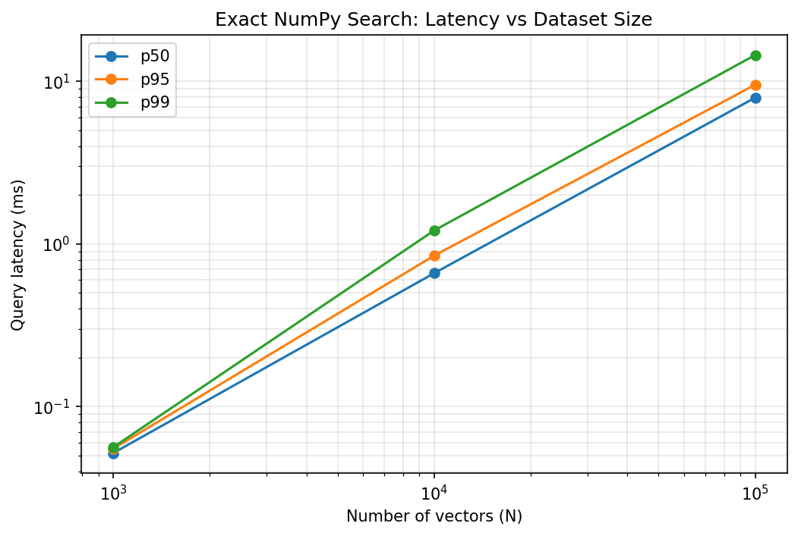

# VectorSearch

A vector search engine built from scratch to understand the **algorithms, mathematics, data structures, memory behavior, and systems trade-offs** behind modern vector databases and approximate nearest-neighbor (ANN) search engines.

The goal is not to build another wrapper around FAISS, HNSWLib, or a vector database.

The goal is to understand and implement the machinery ourselves.

---

# Vision

Modern AI systems depend heavily on vector search:

```text
Embedding Model
      │
      ▼
   Vector
      │
      ▼
┌─────────────────┐
│  Vector Search  │
└─────────────────┘
      │
      ▼
Top-k nearest vectors
      │
      ▼
RAG / Recommendation / Retrieval

This project progressively builds that system from the simplest possible implementation toward a production-oriented approximate nearest-neighbor engine.

The progression is intentional:

```text
Exact Search
     │
     ▼
Vectorized Exact Search
     │
     ▼
Top-k Optimization
     │
     ▼
Dimensionality / Batch Experiments
     │
     ▼
Memory / Cache Optimization
     │
     ▼
Benchmarking
     │
     ▼
HNSW
     │
     ▼
Recall / Latency Trade-offs
     │
     ▼
Persistence
     │
     ▼
Production-oriented Vector Index
```

The project should make the answer to questions like these intuitive:

* Why is brute-force vector search slow?
* Why does NumPy outperform a Python loop?
* What actually determines vector-search latency?
* How does memory layout affect search?
* Why do vector databases use ANN instead of exact search?
* How does HNSW achieve high recall with sublinear search?
* What does `efSearch` actually trade off?
* Why does increasing dimensionality hurt performance?
* How do recall, latency, throughput, and memory interact?
* What happens when the index no longer fits comfortably in cache?
* How do production vector indexes handle persistence and updates?

---

# Current Status

## Completed

* [x] Project structure and packaging
* [x] Vector distance metrics
* [x] Row normalization
* [x] Exact brute-force Python-loop search
* [x] Exact vectorized NumPy search
* [x] Input validation
* [x] Deterministic tie-breaking
* [x] Unit tests for metrics
* [x] Unit tests for exact search
* [x] Unit tests comparing loop and NumPy implementations
* [x] Editable package installation
* [x] Pytest `src/` import configuration
* [x] Reproducible synthetic datasets
* [x] Exact-search benchmark
* [x] Latency measurements
* [x] Benchmark result serialization
* [x] Exact-search latency plot
* [x] Python loop vs NumPy benchmark plot
* [x] Cache / memory benchmark
* [x] Cache / memory benchmark result serialization
* [x] Memory footprint vs latency visualization
* [x] Memory footprint vs throughput visualization
* [x] Top-k `argsort` vs `argpartition` benchmark
* [x] Top-k benchmark result serialization
* [x] Top-k latency visualization
* [x] Top-k QPS visualization
* [x] Top-k speedup visualization
* [x] Dimensionality benchmark
* [x] Dimensionality benchmark result serialization
* [x] Dimensionality vs latency visualization
* [x] Dimensionality vs memory visualization
* [x] Dimensionality vs QPS visualization

## Current Test Status

```text
27 tests passed
```

Run the complete test suite:

```bash
python -m pytest -v
```

---

# Project Structure

```text
vector-search/
│
├── pyproject.toml
├── README.md
│
├── src/
│   └── vector_search/
│       ├── __init__.py
│       ├── metrics.py
│       ├── datasets.py
│       ├── exact_loop.py
│       ├── exact_numpy.py
│       └── hnsw.py                    # planned
│
├── tests/
│   ├── test_metrics.py
│   ├── test_exact.py
│   ├── test_exact_numpy.py
│   └── test_hnsw.py                   # planned
│
├── benchmarks/
│   ├── run_exact.py
│   ├── compare_exact.py
│   ├── run_cache.py
│   ├── plot_cache.py
│   ├── run_topk.py
│   ├── plot_topk.py
│   ├── run_dimension.py
│   ├── plot_dimension.py
│   ├── run_hnsw.py                    # planned
│   ├── compare_faiss.py               # planned
│   │
│   └── results/
│       ├── exact.json
│       ├── exact_comparison.json
│       ├── cache.json
│       ├── topk.json
│       └── dimension.json
│
└── plots/
    ├── exact_latency.png
    ├── exact_loop_vs_numpy.png
    ├── cache_latency.png
    ├── cache_qps.png
    ├── topk_latency.png
    ├── topk_qps.png
    ├── topk_speedup.png
    ├── dimension_latency.png
    ├── dimension_memory.png
    └── dimension_qps.png
```

---

# 1. Vector Metrics

The first layer is the mathematics of similarity search.

## Squared L2 Distance

For two vectors:

```text
q = query
x = database vector
```

we calculate:

```text
d(q, x) = Σ(qᵢ - xᵢ)²
```

We use **squared L2 distance** because the square root is unnecessary when only ranking vectors by distance.

If:

```text
d₁ < d₂
```

then:

```text
√d₁ < √d₂
```

so the ranking is identical.

Implemented in:

```text
src/vector_search/metrics.py
```

## Normalization

We also implemented row-wise vector normalization.

For a vector:

```text
x = [x₁, x₂, ..., xD]
```

its L2 norm is:

```text
||x||₂ = √(Σxᵢ²)
```

and the normalized vector is:

```text
x̂ = x / ||x||₂
```

This becomes important later when comparing cosine similarity with L2 distance.

---

# 2. Exact Brute-Force Search

The first search implementation is deliberately simple.

```text
Query
  │
  ▼
Compare against vector 1
Compare against vector 2
Compare against vector 3
       ...
Compare against vector N
  │
  ▼
Rank candidates
  │
  ▼
Return top-k
```

Implemented in:

```text
src/vector_search/exact_loop.py
```

The main class is:

```python
ExactLoopIndex
```

Example:

```python
index = ExactLoopIndex(3)

index.add([1, 0, 0], item_id=10)
index.add([0, 1, 0], item_id=11)
index.add([0, 0, 1], item_id=12)

result = index.search([1, 0, 0], k=2)
```

The result contains:

```text
ids
distances
```

This implementation serves as the **correctness reference implementation**.

---

# Exact Search Guarantees

The exact index intentionally provides strong correctness guarantees.

## Dimension Validation

Vectors must have exactly the configured dimension.

```text
dimension = 3

[1, 2, 3]       ✓
[1, 2]          ✗
[1, 2, 3, 4]    ✗
```

## Finite-Value Validation

NaN and infinity are rejected.

```text
[1, 2, 3]        ✓
[1, NaN, 3]      ✗
[1, Inf, 3]      ✗
```

This prevents undefined or corrupted distance calculations.

## Duplicate IDs

Each item ID must be unique.

## Valid k

Search requires:

```text
1 <= k <= number_of_vectors
```

## Deterministic Results

Results are ordered by:

```text
(distance, item_id)
```

For example:

```text
distance    ID

1.0         20
1.0         10
```

becomes:

```text
10
20
```

This is important for reproducible tests and benchmarks.

---

# 3. Vectorized Exact Search

The next implementation performs the same mathematical operation using vectorized NumPy operations.

Implemented in:

```text
src/vector_search/exact_numpy.py
```

The core computation is:

```python
distances = np.sum((vectors - query) ** 2, axis=1)
```

Instead of executing a Python loop over every vector, NumPy performs the computation over the complete matrix using optimized native operations.

The important point is that **the algorithm has not changed**.

Both implementations perform exact search:

```text
ExactLoopIndex
      │
      │ same mathematical algorithm
      ▼
ExactNumPyIndex
```

The NumPy implementation therefore gives us a useful performance baseline before introducing approximate search.

---

# 4. Correctness Testing

Every major component is developed test-first.

## Metrics

* known squared-L2 result
* normalized vectors have unit norm

## Exact Search

* correct nearest neighbors
* sorted results
* deterministic tie-breaking
* wrong vector dimension
* duplicate IDs
* empty index
* invalid `k`
* `k=1`
* `k=N`
* wrong query dimension
* NaN vectors
* infinite vectors
* NaN queries
* infinite queries

## NumPy Exact Search

Additional tests verify:

* vector storage
* ID handling
* wrong ID count
* duplicate IDs
* NumPy and loop implementations produce identical results
* multiple randomized trials produce identical nearest-neighbor results
* deterministic tie-breaking when ties occur at the `k` boundary

## Current Test Status

```text
27 passed
```

---

# 5. Benchmarking

We now have reproducible benchmarks for exact vector search.

The benchmarks measure:

* query latency
* p50 latency
* p95 latency
* p99 latency
* queries per second
* build time
* vector memory footprint

---

## Python Loop vs NumPy

The first benchmark compares the straightforward Python implementation against the vectorized NumPy implementation.

The important observation is that **both implementations perform exact nearest-neighbor search**.

The difference is primarily in how the computation is executed:

```text
Python Loop

    │
    ├── Python-level iteration
    ├── Python-level arithmetic
    └── repeated function/object overhead

            VS

NumPy

    │
    ├── vectorized operations
    ├── native compiled code
    └── optimized numerical kernels
```

The benchmark produced the following results on the development machine:

|    N |  Loop p50 | NumPy p50 | Loop QPS | NumPy QPS | QPS Speedup |
| ---: | --------: | --------: | -------: | --------: | ----------: |
|   1K |   2.28 ms |  0.133 ms |      437 |     7,397 |       16.9× |
|  10K |  24.55 ms |   1.88 ms |     37.9 |       528 |       13.9× |
| 100K | 259.69 ms |  23.24 ms |     3.81 |      42.9 |       11.3× |

The NumPy implementation is therefore roughly **11–17× faster** in this experiment while preserving exact results.

The speedup decreases somewhat as the dataset grows because the workload becomes increasingly dominated by memory movement and memory hierarchy effects rather than Python interpreter overhead.

### Benchmark Plot


---

# Exact NumPy Search: Latency vs Dataset Size

The vectorized implementation demonstrates the central limitation of brute-force search:

> Every query examines the entire dataset.

Conceptually:

```text
N increases
    │
    ▼
More vectors examined
    │
    ▼
More distance computations
    │
    ▼
Higher query latency
```

For the NumPy implementation:

```text
N = 1K
    ↓
very low latency

N = 10K
    ↓
higher latency

N = 100K
    ↓
significantly higher latency
```

The benchmark demonstrates that exact search scales approximately linearly with the number of vectors.

### Benchmark Plot



This plot provides the empirical baseline that future optimizations must beat.

---

# Benchmark Environment

The benchmark was run on:

```text
Python:     3.13.5
Platform:   macOS 15.2 arm64
CPU cores:  8 logical cores
RAM:        8 GB
dtype:      float32
```

Results are stored in:

```text
benchmarks/results/exact.json
```

Run the exact-search comparison benchmark with:

```bash
PYTHONPATH=src python benchmarks/compare_exact.py
```

---

# Vector Memory Footprint

For `float32`, every dimension requires:

```text
4 bytes
```

Therefore:

```text
memory = N × D × 4 bytes
```

For `D = 128`:

```text
1K vectors
    = 1,000 × 128 × 4
    ≈ 0.5 MB

10K vectors
    ≈ 5 MB

100K vectors
    ≈ 51.2 MB
```

This memory footprint becomes important when studying cache behavior.

The dataset may fit inside some levels of the CPU cache at small sizes, while larger datasets increasingly require accesses to higher-level cache or main memory.

---

# 6. Cache and Memory Behavior

Once the algorithm is vectorized, memory behavior becomes an important part of performance.

The objective of this experiment is to understand how increasing the vector dataset changes the working set and query latency.

We benchmarked dataset sizes from:

```text
N = 256
N = 512
N = 1K
N = 2K
N = 4K
N = 8K
N = 16K
N = 32K
N = 64K
N = 128K
N = 256K
N = 512K
N = 1M
```

with:

```text
D = 128
k = 10
queries = 200
dtype = float32
```

The experiment measures:

* vector memory footprint
* p50 latency
* p95 latency
* p99 latency
* QPS
* build time

## Current Results

The working set grows from approximately:

```text
0.125 MB
```

at 256 vectors to:

```text
488.28 MB
```

at 1 million vectors.

Observed p50 latency grows from:

```text
0.036 ms
```

to:

```text
285.774 ms
```

while QPS falls from approximately:

```text
25,879 QPS
```

to:

```text
2.74 QPS
```

The experiment therefore demonstrates the strong relationship between dataset size, memory footprint, and brute-force query latency.

Results are stored in:

```text
benchmarks/results/cache.json
```

Run the experiment with:

```bash
PYTHONPATH=src python benchmarks/run_cache.py
```

---

## Memory Footprint vs Query Latency

The first cache experiment plots vector memory footprint against query latency.

Both p50 and p95 latency are shown.


As the working set becomes larger, the amount of data that must be processed for every exact query also increases.

This provides an empirical basis for investigating:

```text
Dataset size
      │
      ▼
Working-set size
      │
      ▼
Memory hierarchy
      │
      ▼
Query latency
```

The important point is that this experiment does **not** by itself prove a specific CPU-cache boundary.

Rather, it establishes the performance behavior that we can investigate further using profiling and hardware-performance measurements.

---

## Memory Footprint vs Throughput

The second experiment examines the same workload from a throughput perspective.


The trend is approximately:

```text
Memory footprint increases
          │
          ▼
More vectors scanned per query
          │
          ▼
Higher query cost
          │
          ▼
Lower QPS
```

At small working-set sizes, the implementation can process queries at high throughput.

As the dataset grows, each query requires processing substantially more vector data, causing throughput to fall.

---

# Cache / Memory Experiment

The complete experiment can be summarized as:

```text
Small Dataset
     │
     ▼
Small Working Set
     │
     ▼
Low Query Latency
     │
     ▼
High Throughput


Large Dataset
     │
     ▼
Large Working Set
     │
     ▼
More Data Processed
     │
     ▼
Higher Query Latency
     │
     ▼
Lower Throughput
```

This experiment motivates the next level of systems investigation:

* CPU cache hierarchy
* memory bandwidth
* SIMD utilization
* contiguous memory access
* allocation overhead
* batching
* vector dimensionality

---

# 7. Top-k Selection

The current exact implementation does more work than necessary when `k` is small.

If:

```text
N = 1,000,000
k = 10
```

we only need the 10 closest vectors.

Fully sorting one million distances is unnecessary.

We therefore compare:

```text
Full sorting
     │
     ▼
np.argsort

        vs

Partial selection
     │
     ▼
np.argpartition
     │
     ▼
Sort only the selected candidates
```

This introduces an important systems principle:

> **Do not perform work that the query does not require.**

The goal is to preserve exact results while reducing the cost of selecting the nearest `k` vectors.

---

## Benchmark Configuration

The top-k experiment uses:

```text
D = 128
k = 10
queries = 200

N = 1K
N = 10K
N = 100K
N = 1M
```

Both methods are checked for exact equivalence before accepting the performance results.

The benchmark compares:

```text
np.argsort
vs
np.argpartition + final sort
```

### Observed Results

|    N | argsort p50 | argpartition p50 | Speedup |
| ---: | ----------: | ---------------: | ------: |
|   1K |    0.128 ms |         0.078 ms |   1.64× |
|  10K |    2.052 ms |         1.225 ms |   1.67× |
| 100K |   23.336 ms |        11.565 ms |   2.02× |
|   1M |  279.787 ms |       135.542 ms |   2.06× |

The improvement becomes more significant as `N` increases.

This is exactly what we would expect from avoiding a complete sort of all `N` distances when only `k` results are required.

Results are stored in:

```text
benchmarks/results/topk.json
```

Run the benchmark with:

```bash
PYTHONPATH=src python benchmarks/run_topk.py
```

---

## Top-k Latency


The latency comparison demonstrates that partial selection becomes increasingly valuable as the number of candidates grows.

---

## Top-k QPS


Avoiding unnecessary sorting increases throughput, especially for larger datasets.

---

## Top-k Speedup


The measured speedup grows from approximately:

```text
1.64× at N=1K
```

to:

```text
2.06× at N=1M
```

The important lesson is that algorithmic work inside an exact search query matters even when the distance computation itself remains unchanged.

---

# 8. Dimensionality Experiments

After understanding dataset-size scaling and top-k selection, the next experiment investigates the effect of vector dimensionality.

The distance calculation itself is:

```text
d(q, x) = Σ(qᵢ - xᵢ)²
```

Therefore, increasing `D` increases the amount of numerical work required for every vector comparison.

It also increases the amount of memory transferred.

We benchmarked:

```text
D = 64
D = 128
D = 384
D = 768
D = 1536
```

using:

```text
N = 100,000
k = 10
queries = 200
dtype = float32
```

The experiment measures:

* vector memory footprint
* p50 latency
* p95 latency
* p99 latency
* QPS

---

## Current Results

The observed results were:

| Dimension |    Memory | p50 Latency | p95 Latency |   QPS |
| --------: | --------: | ----------: | ----------: | ----: |
|        64 |  24.41 MB |   18.269 ms |   18.741 ms | 54.54 |
|       128 |  48.83 MB |   23.349 ms |   26.343 ms | 40.84 |
|       384 | 146.48 MB |   49.436 ms |   51.623 ms | 19.99 |
|       768 | 292.97 MB |   91.329 ms |   99.598 ms | 10.84 |
|      1536 | 585.94 MB |  182.590 ms |  279.599 ms |  4.98 |

The experiment shows a clear relationship:

```text
Higher dimensionality
        │
        ▼
More values per vector
        │
        ▼
More computation
        │
        ▼
More memory traffic
        │
        ▼
Higher latency
        │
        ▼
Lower QPS
```

The relationship is not perfectly linear because actual performance also depends on memory hierarchy, vectorization, allocation behavior, and other system effects.

---

## Dimensionality vs Latency


Latency increases substantially as dimensionality grows.

At `D=1536`, p50 latency is approximately ten times the `D=64` latency in this experiment.

---

## Dimensionality vs Memory


For a fixed number of vectors, memory usage grows linearly with dimensionality:

```text
memory = N × D × sizeof(dtype)
```

For `float32`:

```text
sizeof(float32) = 4 bytes
```

Therefore doubling dimensionality approximately doubles the vector storage requirement.

---

## Dimensionality vs QPS


As dimensionality increases, the number of vectors that can be processed per second decreases.

This provides another important systems lesson:

> Vector search performance is determined not only by the number of vectors, but also by the amount of data contained in each vector.

Results are stored in:

```text
benchmarks/results/dimension.json
```

Run the experiment with:

```bash
PYTHONPATH=src python benchmarks/run_dimension.py
```

---

# 9. Batch Search

The next systems experiment will investigate batch queries.

Instead of:

```text
query
  │
  ▼
search
  │
  ▼
result
```

we can process:

```text
query 1 ─┐
query 2 ─┤
query 3 ─┤
   ...   ┤
query N ─┘
         │
         ▼
    batch search
```

The objective is to understand whether processing multiple queries together improves hardware utilization.

We will investigate:

```text
batch size = 1
batch size = 8
batch size = 16
batch size = 32
batch size = 64
batch size = 128
```

and measure:

* total batch latency
* per-query latency
* QPS
* memory usage

Important questions include:

* Does batching improve throughput?
* Does batching increase individual query latency?
* When does batching become memory-bound?
* Does NumPy achieve better hardware utilization with larger batches?

---

# 10. Memory Layout and Data Representation

After dimensionality and batching, we will investigate how vector representation affects performance.

Topics include:

* contiguous arrays
* row-major layout
* `float32` vs `float64`
* alignment
* memory bandwidth
* SIMD/vectorization
* allocation overhead

For example:

```text
float32
    ↓
4 bytes / dimension

float64
    ↓
8 bytes / dimension
```

Using a wider datatype increases memory traffic and storage requirements.

The goal is to measure the actual performance consequences rather than assuming that a particular representation is always better.

---

# 11. HNSW

After understanding exact search, we will implement:

```text
src/vector_search/hnsw.py
```

from scratch.

HNSW stands for:

**Hierarchical Navigable Small World**

Instead of comparing the query against every vector:

```text
Query
  │
  ├── vector 1
  ├── vector 2
  ├── vector 3
  ├── ...
  └── vector N
```

we construct a navigable graph:

```text
        Layer 2

          A

         / \

        B   C


        Layer 1

     A──B──C──D──E
      \    \  /


       F────G


        Layer 0

 A──B──C──D──E──F──G──H──I...
```

Search navigates through the graph instead of exhaustively evaluating every vector.

This introduces the fundamental ANN trade-off:

```text
                 Recall
                   ▲
                   │
                   │       ●
                   │    ●
                   │  ●
                   │ ●
                   └──────────────► Latency
```

We will study how:

```text
M
efConstruction
efSearch
```

affect:

* recall
* latency
* memory
* build time

---

# 12. Recall Evaluation

Exact search becomes our ground truth.

For each query:

```text
Exact Search
     │
     ▼
Ground-truth top-k
```

and:

```text
HNSW
 │
 ▼
Approximate top-k
```

we compare the results.

A simple recall@k metric is:

```text
recall@k =

|approximate top-k ∩ exact top-k|
---------------------------------
                k
```

This allows us to create real recall/latency curves.

The exact implementation is therefore not merely the first implementation — it remains useful throughout the project as the **ground-truth oracle**.

---

# 13. Persistence

Eventually the index should survive process restarts.

We will investigate:

```text
build index
     │
     ▼
   save
     │
     ▼
   disk
     │
     ▼
   load
     │
     ▼
  search
```

This introduces:

* serialization
* binary formats
* metadata
* versioning
* compatibility
* memory mapping

Memory mapping will be particularly interesting because it connects persistence directly with the memory/cache experiments.

---

# 14. Production-Oriented Features

Eventually we may explore:

* batch insertion
* batch search
* deletion
* updates
* persistence
* memory mapping
* concurrent search
* concurrent insertion
* sharding
* filtering
* hybrid search
* quantization
* compressed vectors
* observability
* benchmark automation

These features will be introduced only after understanding the underlying algorithms and systems behavior.

---

# Comparison Targets

Once our implementations are mature enough, we will compare against established libraries such as:

```text
FAISS
HNSWlib
```

The purpose is **not** to beat production libraries.

The purpose is to understand:

```text
Our implementation
       │
       ▼
What optimization are we missing?
       │
       ▼
What does a mature implementation do differently?
```

External libraries therefore serve as reference points rather than shortcuts.

---

# Experimental Philosophy

Every optimization should follow:

```text
Implement
   │
   ▼
Test correctness
   │
   ▼
Benchmark
   │
   ▼
Profile
   │
   ▼
Understand bottleneck
   │
   ▼
Optimize
   │
   ▼
Benchmark again
```

We should avoid optimizing based purely on intuition.

For every major optimization, we want to answer:

1. What was the bottleneck?
2. What changed?
3. Why should it be faster?
4. Did the benchmark confirm it?
5. Did correctness remain unchanged?
6. What new bottleneck appeared?

---

# Guiding Principle

The project follows a simple progression:

```text
Correctness
     ↓
Clarity
     ↓
Measurement
     ↓
Optimization
     ↓
Approximation
     ↓
Systems engineering
```

We intentionally start with the simplest possible implementation.

A slow but obviously correct implementation is extremely valuable because it gives us a **ground-truth reference implementation** against which every future optimization can be tested.

---

# Current Milestones

## Milestone 1 — Exact Search Baseline

```text
COMPLETE
```

Implemented:

```text
✓ Metrics
✓ Normalization
✓ ExactLoopIndex
✓ Validation
✓ Deterministic ordering
✓ Unit tests
✓ Packaging
```

---

## Milestone 2 — Vectorized Exact Search

```text
COMPLETE
```

Implemented:

```text
✓ ExactNumPyIndex
✓ Vectorized distance computation
✓ Input validation
✓ Deterministic ordering
✓ NumPy vs loop correctness tests
✓ Randomized equivalence tests
✓ Reproducible benchmark
✓ Latency measurements
✓ Benchmark JSON output
✓ Exact-search latency visualization
✓ Python loop vs NumPy visualization
```

Current test status:

```text
27 passed
```

The key result from this milestone is that we now have a **measured exact-search baseline**.

---

## Milestone 3 — Cache / Memory Experiment

```text
COMPLETE
```

Implemented:

```text
✓ Working-set size benchmark
✓ Dataset sizes from 256 → 1M vectors
✓ Memory footprint measurement
✓ p50 latency measurement
✓ p95 latency measurement
✓ p99 latency measurement
✓ QPS measurement
✓ Build-time measurement
✓ Benchmark JSON output
✓ Memory vs latency visualization
✓ Memory vs QPS visualization
```

The experiment demonstrated the expected system-level trend:

```text
Larger Dataset
      │
      ▼
Larger Working Set
      │
      ▼
More Vector Data Processed
      │
      ▼
Higher Query Latency
      │
      ▼
Lower Throughput
```

Results:

```text
benchmarks/results/cache.json
```

Plots:

```text
plots/cache_latency.png
plots/cache_qps.png
```

---

## Milestone 4 — Top-k Optimization

```text
COMPLETE
```

Implemented:

```text
✓ argsort baseline
✓ argpartition-based selection
✓ Final sorting of selected candidates
✓ Correctness equivalence checks
✓ p50 latency measurement
✓ p95 latency measurement
✓ p99 latency measurement
✓ QPS measurement
✓ Speedup calculation
✓ Benchmark JSON output
✓ Top-k latency visualization
✓ Top-k QPS visualization
✓ Top-k speedup visualization
```

The benchmark demonstrated:

```text
N = 1K
    ↓
1.64× speedup

N = 10K
    ↓
1.67× speedup

N = 100K
    ↓
2.02× speedup

N = 1M
    ↓
2.06× speedup
```

The key lesson is:

> **Exact search can be optimized without changing the underlying nearest-neighbor algorithm.**

We can reduce unnecessary ranking work while preserving exact results.

Results:

```text
benchmarks/results/topk.json
```

Plots:

```text
plots/topk_latency.png
plots/topk_qps.png
plots/topk_speedup.png
```

---

## Milestone 5 — Dimensionality Experiment

```text
COMPLETE
```

Implemented:

```text
✓ Dimensionality benchmark
✓ D = 64
✓ D = 128
✓ D = 384
✓ D = 768
✓ D = 1536
✓ Memory footprint measurement
✓ p50 latency measurement
✓ p95 latency measurement
✓ p99 latency measurement
✓ QPS measurement
✓ Benchmark JSON output
✓ Dimensionality vs latency visualization
✓ Dimensionality vs memory visualization
✓ Dimensionality vs QPS visualization
```

The experiment demonstrated:

```text
Higher Dimension
       │
       ▼
More computation per vector
       │
       ▼
More memory traffic
       │
       ▼
Higher latency
       │
       ▼
Lower throughput
```

Results:

```text
benchmarks/results/dimension.json
```

Plots:

```text
plots/dimension_latency.png
plots/dimension_memory.png
plots/dimension_qps.png
```

---

# Next Milestone

## Milestone 6 — Batch Search + Systems Optimization

The next stage is to investigate how multiple queries can be processed together.

We will compare:

```text
Single-query search

vs

Batch search
```

and investigate:

```text
batch size
     │
     ▼
hardware utilization
     │
     ▼
memory traffic
     │
     ▼
throughput
```

We will measure:

* batch latency
* per-query latency
* QPS
* memory usage
* scaling with batch size

After that, we will investigate memory layout, datatype effects, and deeper cache/memory profiling.

---

# Future Systems Experiments

After batch search, the planned progression is:

```text
Batch Search
      │
      ▼
Memory Layout
      │
      ▼
float32 vs float64
      │
      ▼
SIMD / Vectorization
      │
      ▼
Cache / Memory Profiling
      │
      ▼
HNSW
      │
      ▼
Recall / Latency Trade-offs
      │
      ▼
Persistence
      │
      ▼
Production-oriented Features
```

Only after understanding these exact-search bottlenecks will we move to HNSW.

The goal is to progressively move from:

> **"I know how vector search works."**

to:

> **"I understand why a production vector search engine is designed this way."**
